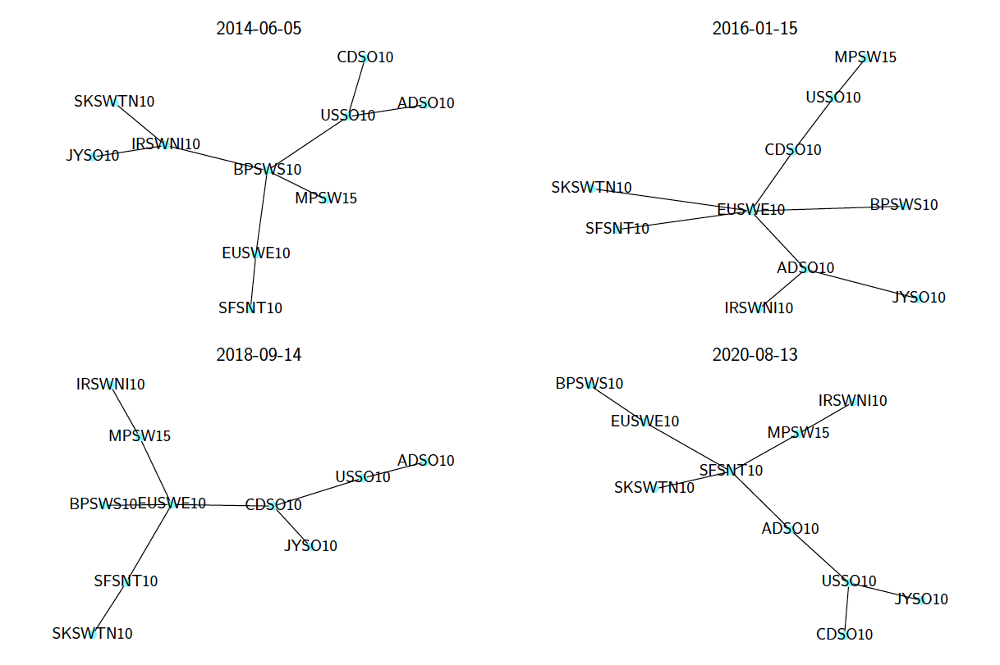
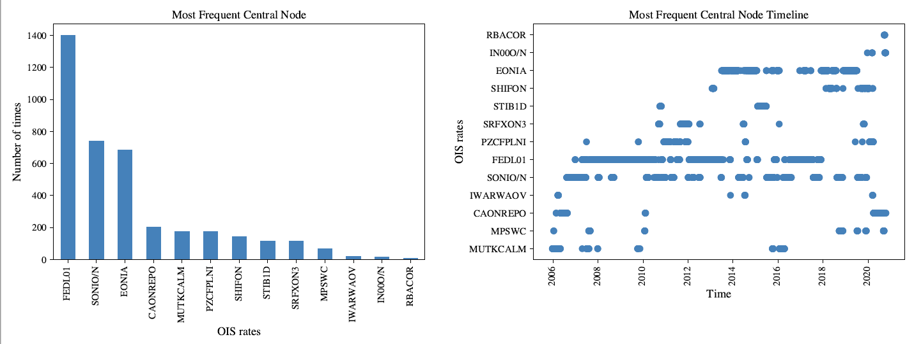

# Working_With_Bloomberg
**This GitHub repo will provide step-by-step instruction and codes for collecting data from bloomberg Terminal.** 

#### Getting-Minute-By-Minute-Data-From-Bloomberg
**The python program [Min_by_Min.py] will allow you to collect Intraday data from Bloomberg**

Set the intended intra-day period in the "interval = 1" fo minute by minute data. 

	f = LocalTerminal.get_intraday_bar(ticker, event, start, end, interval=10).as_frame()

Determine the number of days you want the data from. Bloomberg only allow 180 days back for intraday data. 
		
	days_back = 180

Set the trickers, it worked for currency, stock or index. 

	Trickers = ['USCRWTIC Index', 'EUCRBRDT Index','CORNILNC Index', 'WEATTKHR Index', 'GCFPURGB Index', 'NGUSHHUB BGAP Index', 'JETIGCPR Index' ]

### Getting OIS Data From Bloomberg Terminal 
**The python program [fx_download.py](fx_download.py) will allow you to collect Daily OIS rate data from Bloomberg**  
**This OIS data is used in our project `Finance Research Letters` Paper [The network structure of overnight index swap rates](https://www.sciencedirect.com/science/article/pii/S1544612321004141)  

Running this python program will collect the OIS rates for all the currency pairs e.g., `AUD`, `CAD`, `CHF` , `EUR`, `GBP`, `JPY`, `NOK`, `NZD`, `SEK`, `USD` of last 365 days, and write it into a csv file. 

[Fig](Figures/OIS_10.pdf)

 

  

 
 

  

